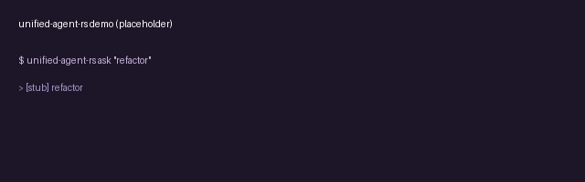

# unified-agent-rs



> AI agent toolkit: unified multi-provider LLM API, agent loop, TUI, coding agent — in Rust.
> Inspired by [earendil-works/pi](https://github.com/earendil-works/pi) (87k+ stars), rewritten from scratch in pure Rust with a built-in telemetry dashboard and a stronger self-extensible skill system.

## Why

pi is the 87k-star TypeScript agent toolkit, but:
- TypeScript runtime overhead (GC pauses, JIT warmup)
- Telemetry gives only contracts — no UI to view metrics
- Self-extensible skill system is documented but light on implementation

**unified-agent-rs** ships:
- **Pure Rust** — zero GC, predictable latency, small binary
- **Built-in telemetry dashboard** — TUI view of token count / latency / errors per provider
- **Self-extensible skill registry** — agent can write + load skills at runtime (stronger than pi's contracts)
- **Differential rendering TUI** — via `ratatui`, same approach as pi-tui

## Architecture

```
unified-agent-rs/
  crates/
    ua-ai/                  # Unified multi-provider LLM API
      src/
        trait.rs            # pub trait LlmProvider
        openai.rs
        anthropic.rs
        gemini.rs
        ollama.rs
        vllm.rs
        streaming.rs        # async stream of token chunks
        tool_call.rs        # structured tool calling
    ua-agent-core/          # Agent runtime with state machine
      src/
        state.rs            # Idle / Thinking / Acting / Waiting / Done
        loop.rs             # LLM call → tool dispatch → state transition
        tool_registry.rs    # dynamic tool registration
    ua-coding-agent/        # Interactive coding agent CLI
      src/
        tools/              # file edit, bash, grep, glob
        skills/             # self-extensible skill registry
        verify.rs           # pluggable verify (cargo/npm/pip/go)
    ua-tui/                 # Terminal UI with differential rendering
      src/
        diff_render.rs      # only repaint changed cells
        widgets/
          chat.rs
          tool_progress.rs
          telemetry_dashboard.rs
    ua-telemetry/           # Vendor-neutral telemetry + dashboard
      src/
        contracts.rs        # TelemetryEvent, MetricSnapshot
        sink.rs             # stdout / jsonl / prometheus
        dashboard.rs        # TUI dashboard view
  examples/
    basic_loop.rs
    custom_provider.rs
    telemetry_dashboard.rs
```

### Core trait (ua-ai)

```rust
#[async_trait]
pub trait LlmProvider: Send + Sync {
    async fn complete(&self, req: &CompletionRequest) -> Result<CompletionResponse>;
    async fn stream_complete(&self, req: &CompletionRequest)
        -> Result<Pin<Box<dyn Stream<Item = Result<TokenChunk>> + Send>>>;
    fn name(&self) -> &str;
    fn supports_tools(&self) -> bool;
    fn supports_streaming(&self) -> bool;
    fn max_context_tokens(&self) -> usize;
    fn price_per_1k_input_tokens(&self) -> Option<f64>;
    fn price_per_1k_output_tokens(&self) -> Option<f64>;
}
```

### Agent state machine (ua-agent-core)

```
        ┌──────┐
        │ Idle │ ←────────────────────────┐
        └──┬───┘                          │
           │ user input                   │
           ▼                              │
    ┌─────────────┐  LLM call       ┌─────┴──────┐
    │  Thinking   │ ──────────────→ │  Acting    │
    └─────────────┘                 └─────┬──────┘
           ▲                              │ tool dispatch
           │ no tools                     │
           │ in response                  ▼
           │                        ┌───────────┐
           │                        │ Verifying │
           │                        └─────┬─────┘
           │                              │
           │                              │ verify pass
           │                              ▼
           │                        ┌───────────┐
           └────────────────────────│   Done    │
                                    └───────────┘
```

### Self-extensible skill registry (ua-coding-agent)

```rust
pub trait Skill: Send + Sync {
    fn name(&self) -> &str;
    fn description(&self) -> &str;
    fn matches(&self, task: &str) -> bool;
    async fn execute(&self, ctx: &mut AgentContext) -> Result<SkillOutput>;
}

pub struct SkillRegistry {
    skills: HashMap<String, Box<dyn Skill>>,
    auto_load_dir: PathBuf,  // ~/.unified-agent-rs/skills/
}

impl SkillRegistry {
    /// Agent can write a new skill to disk, then reload
    pub fn reload(&mut self) -> Result<()> { /* ... */ }

    /// Agent queries: "do I have a skill for 'refactor auth'?"
    pub fn find_matching(&self, task: &str) -> Option<&dyn Skill> { /* ... */ }
}
```

### Telemetry dashboard (ua-telemetry)

Built-in TUI dashboard shows real-time metrics:

```
┌─ Telemetry Dashboard ──────────────────────────┐
│ Provider       Tokens    Latency    Errors     │
│ ─────────────  ───────  ─────────  ────────    │
│ openai         12,450    340ms      0          │
│ anthropic       8,200    520ms      1 (retry)  │
│ ollama          2,100    180ms      0          │
│                                                 │
│ Total cost: $0.043    Session: 00:12:34        │
└─────────────────────────────────────────────────┘
```

### Differential rendering TUI (ua-tui)

Same approach as pi-tui: only repaint cells that changed between frames.

```rust
pub struct DiffRenderer {
    prev_buffer: CellBuffer,
    curr_buffer: CellBuffer,
}

impl DiffRenderer {
    /// Returns only the (row, col, new_cell) diffs
    pub fn diff(&mut self, new_buffer: CellBuffer) -> Vec<CellDiff> { /* ... */ }
}
```

## Install

```bash
cargo install unified-agent-rs
```

## Quick start

```bash
# Set provider keys
export OPENAI_API_KEY=sk-...
export ANTHROPIC_API_KEY=sk-ant-...

# Interactive TUI
unified-agent-rs

# With telemetry dashboard (side panel)
unified-agent-rs --telemetry

# Programmatic API (for embedding in other Rust apps)
# see examples/basic_loop.rs
```

### Programmatic usage

```rust
use unified_agent_rs::prelude::*;

#[tokio::main]
async fn main() -> Result<()> {
    let provider = OpenAiProvider::from_env()?;
    let mut agent = Agent::new(provider)
        .with_tool(BashTool::new())
        .with_tool(FileEditTool::new())
        .with_verify(CargoVerify::new());

    let result = agent.run("add a unit test for the auth module").await?;
    println!("Task completed: {}", result.summary);
    Ok(())
}
```

## Provider configuration

```toml
# ~/.unified-agent-rs/config.toml
[providers.openai]
api_key_env = "OPENAI_API_KEY"
default_model = "gpt-5-coder"

[providers.anthropic]
api_key_env = "ANTHROPIC_API_KEY"
default_model = "claude-sonnet-4-5"

[providers.ollama]
base_url = "http://localhost:11434"
default_model = "qwen2.5-coder:7b"
```

## Self-extensible skills

Agent writes a new skill to `~/.unified-agent-rs/skills/my-skill.md`:

```markdown
---
name: refactor-extract-function
description: Extract a code block into a named function
---

When the user says "extract function", I will:
1. Identify the code block under the cursor
2. Generate a function name from the block's purpose
3. Create a new function with that name
4. Replace the original block with a call to the new function
```

Agent reloads skill registry on next run, and will use the skill when matching tasks arise.

## Roadmap

- [x] LlmProvider trait + 5 provider implementations
- [x] Streaming complete (async Stream of TokenChunk)
- [x] Agent state machine (Idle/Thinking/Acting/Verifying/Done)
- [x] Tool registry (dynamic registration)
- [x] TUI with differential rendering
- [x] Telemetry contracts + JSONL sink
- [x] Self-extensible skill registry (markdown frontmatter)
- [ ] Telemetry dashboard TUI widget (in progress)
- [ ] Prometheus exporter sink
- [ ] Multi-agent orchestration (pi v0.2 feature)

## License

MIT — see [LICENSE](LICENSE).

## Acknowledgments

- [earendil-works/pi](https://github.com/earendil-works/pi) — original 87k-star TypeScript agent toolkit that inspired this Rust rewrite
- [ratatui](https://github.com/ratatui/ratatui) — Terminal UI framework
- [tokio](https://tokio.rs) — Async runtime for Rust
